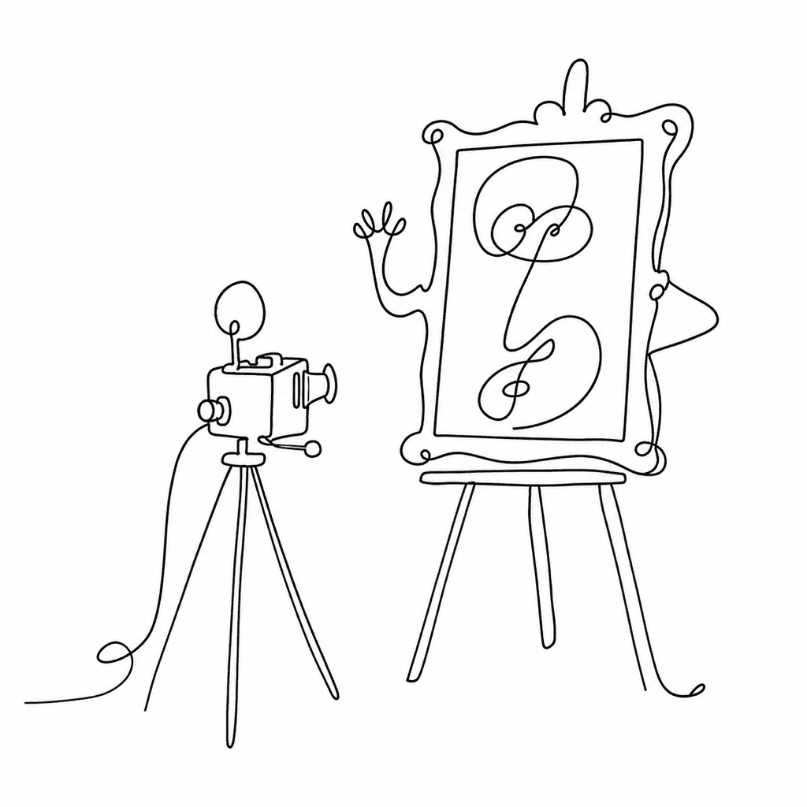

# googlefonts-images

A gallery of thumbnail portraits — one for every font family in [Google Fonts](https://github.com/google/fonts). Each PNG shows the family's primary font rendering a short sample, and each lives at a URL you can guess before you visit it.



## What's in here

Two things:

- **`img/17/`** — the pictures. One PNG per Google Fonts family, rendered at 17 pixels-per-em. About 1,380 of them. This is the deliverable; the images are served straight from GitHub Pages.
- **`build_images.py`** — the script that made them. Point it at a local clone of the Google Fonts repo and it walks every family folder, picks the primary font, invents a sample string, and hands the whole thing to HarfBuzz for rendering.

## The URL schema

Every image sits at a predictable address:

```
https://twardoch.github.io/googlefonts-images/img/17/<family>.png
```

The `<family>` part is the folder name from the Google Fonts repo. Roboto lives at [`google/fonts/tree/main/apache/roboto`](https://github.com/google/fonts/tree/main/apache/roboto), so its picture is:

```
https://twardoch.github.io/googlefonts-images/img/17/roboto.png
```

Know the family folder, know the image URL. No index to consult, no lookup table.

## How a picture gets made

Three decisions turn a font family into a thumbnail:

1. **Which font?** A family folder can hold many weights and styles. The script picks the one with the shortest file path — usually the plain regular — and renders that.
2. **What text?** For families that cover Latin, the sample is a fixed phrase plus one random word. For everything else, the script finds the font's dominant script (the one with the most codepoints covered) and stitches a sample from randomly chosen glyphs in that script. Non-Latin samples are deliberately nonsensical — they show the shapes, not the language — and connecting scripts can produce odd joins.
3. **How big?** 17 pixels-per-em, rendered by `hb-view`, HarfBuzz's command-line viewer. The `17` in the path is the PPM; run the script at another size and you get another folder.

## Regenerating the images

You need HarfBuzz's `hb-view` on your PATH and a local copy of the Google Fonts repo.

macOS (and probably Linux):

1. Install [Homebrew](https://brew.sh/).
2. `brew install harfbuzz python`
3. `python3 -m pip install -r requirements.txt`
4. Clone Google Fonts: `git clone --depth 1 https://github.com/google/fonts.git`

Then render:

```
./build_images.py -f /path/to/google/fonts
```

Options:

```
usage: ./build_images.py [-h] -f folder [-i folder] [-p int]

  -f, --fonts folder    Local clone of https://github.com/google/fonts (required)
  -i, --images folder   Where to write the PNGs (default: ./img)
  -p, --ppm int         Pixels-per-em to render at (default: 17)
```

The script prints each family, its detected script, the sample text, and the source font path as it goes — handy for spotting a font that rendered wrong.

## Requirements

- `harfbuzz` (provides the `hb-view` CLI)
- Python 3.9+
- `fontTools` and `sh` (see `requirements.txt`)

## License

Apache 2.0. See [LICENSE](LICENSE). The rendered fonts remain under their own licenses (OFL, Apache, or UFL) as shipped in the Google Fonts repo.
